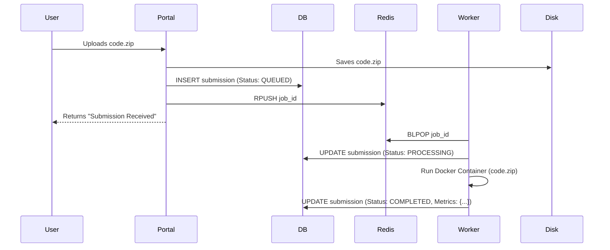

# Codebase Explanation

This document provides a technical deep-dive into the "Efficient-Decode Competition" boilerplate. It explains how the components interact and the specific logic within each service.

## 1. System Architecture

The interaction flow is as follows:

1.  **User** submits a zip file via the **Portal**.
2.  **Portal** saves the file, creates a DB record, and pushes a Job ID to **Redis**.
3.  **Worker** (running continuously) picks up the Job ID from **Redis**.
4.  **Worker** retrieves the file, builds a Docker container (simulated), runs the code, and saves results to the **DB**.

## 2. Component Analysis

### A. Configuration & Orchestration (`docker-compose.yml`)
The core orchestrator. It defines three services:
*   `portal`: Maps port 8000. Mounts the source code (`/app/...`) for live reloading during development.
*   `worker`: Mounts the source code. crucial: It mounts `/var/run/docker.sock` so the worker can spawn *sibling containers* (Docker-in-Docker pattern) to sandbox user code.
*   `redis`: The message broker.

### B. Shared Logic (`common/`)
Since both Portal and Worker need to talk to the Database, the schemas are shared here.
*   **`models.py`**: Pydantic models used for data validation (mostly unused in the simple MPV, but ready for API expansion).
*   **`db.py`**: SQLAlchemy setup.
    *   `Base`: The declarative base for our SQL tables.
    *   `Submission`: The core table. Tracks `status` (queued, processing, completed), `file_path`, and `result_metrics` (JSON blob for storing accuracy/latency).

### C. The Portal (`portal/`)
The entry point for users. Built with **FastAPI**.
*   **`app.py`**:
    *   `GET /`: Renders `templates/index.html` with a list of submissions.
    *   `POST /submit`:
        1.  **File Handling**: Uses `shutil` to stream the uploaded file to `data/uploads/` to avoid memory issues with large models.
        2.  **DB Record**: Creates a `Submission` row with status `QUEUED`.
        3.  **Enqueue**: Calls `scheduler.queue.enqueue_submission(id)`. *Crucial*: We only send the ID to Redis, not the file itself.
*   **`templates/index.html`**: A simple Jinja2 template using Bootstrap. It loops through `submissions` passed from the backend.

### D. The Scheduler (`scheduler/`)
A thin wrapper around **Redis Queue (RQ)**.
*   **`queue.py`**: Connects to Redis. The function `enqueue_submission` is the producer. It tells RQ to execute the function `worker.executor.process_submission` with specific arguments.

### E. The Worker (`worker/`)
The execution engine.
*   **`executor.py`**: Contains the consumer function `process_submission(submission_id)`.
    *   **Context**: This runs in a separate process/container from the Portal.
    *   **Logic**:
        1.  Fetches `Submission` from DB by ID.
        2.  Updates status to `PROCESSING`.
        3.  **Simulation**: Currently `time.sleep(5)` simulates the training loop.
        4.  **Future Implementation**: In a real scenario, this would use the `docker` python client to:
            ```python
            client.containers.run(
                image="submission_image",
                volumes={submission.file_path: {'bind': '/code', 'mode': 'rw'}},
                runtime="nvidia" # for GPU access
            )
            ```
        5.  Updates status to `COMPLETED` and saves dummy metrics.

## 3. Data Flow Example


